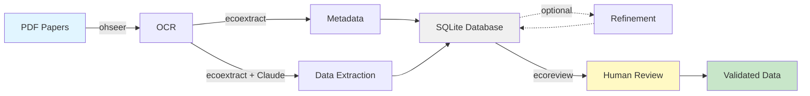

# EcoExtract

Structured ecological data extraction and refinement from scientific literature.

EcoExtract automates the extraction of structured data from PDFs using OCR and LLMs. It's domain-agnostic and works with any JSON schema you define.

## Pipeline



<br>

| Package | Purpose | Links |
|---------|---------|-------|
| [ohseer](https://github.com/n8layman/ohseer) | OCR processing via Tensorlake | [GitHub](https://github.com/n8layman/ohseer) |
| [ecoextract](https://github.com/n8layman/ecoextract) | AI-powered extraction pipeline | [Docs](https://n8layman.github.io/ecoextract/) \| [GitHub](https://github.com/n8layman/ecoextract) |
| [ecoreview](https://github.com/n8layman/ecoreview) | Interactive Shiny review app | [GitHub](https://github.com/n8layman/ecoreview) |

**Quick Links:**

- [Complete Guide](https://n8layman.github.io/ecoextract/articles/ecoextract-workflow.html) (Installation, workflow, review, accuracy)
- [Configuration Guide](https://n8layman.github.io/ecoextract/articles/configuration.html) (Custom schemas and prompts)
- [Accuracy Metrics Guide](ACCURACY.md) (Understanding accuracy calculations)

## Installation

```r
# Install the ecosystem (pak recommended)
pak::pak("n8layman/ohseer")      # OCR processing
pak::pak("n8layman/ecoextract")  # Data extraction
pak::pak("n8layman/ecoreview")   # Review app (optional)
```

See the [Complete Guide](https://n8layman.github.io/ecoextract/articles/ecoextract-workflow.html) for alternative installation methods and troubleshooting.

## API Key Setup

EcoExtract uses [ellmer](https://ellmer.tidyverse.org/) for LLM interactions and [ohseer](https://github.com/n8layman/ohseer) for OCR via Tensorlake.

**Required API keys:**

- Tensorlake (OCR): <https://www.tensorlake.ai/>
- Anthropic Claude (extraction): <https://console.anthropic.com/>

Create a `.env` file in your project root (make sure it's in `.gitignore` first!):

```bash
ANTHROPIC_API_KEY=your_anthropic_api_key_here
TENSORLAKE_API_KEY=your_tensorlake_api_key_here
```

The `.env` file is automatically loaded when R starts in the project directory. See the [Complete Guide](https://n8layman.github.io/ecoextract/articles/ecoextract-workflow.html#api-key-setup) for detailed setup instructions.

By default, ecoextract uses `anthropic/claude-sonnet-4-5`. To use a different provider, pass the `model` parameter to `process_documents()`. Note: non-Anthropic providers have not been fully tested.

## Quick Start

```r
library(ecoextract)

# Process all PDFs in a folder through the 4-step pipeline:
# OCR -> Metadata -> Extraction -> Refinement (optional)
results <- process_documents(
  pdf_path = "path/to/pdfs/",
  db_conn = "ecoextract_records.db"
)

# Retrieve your data
records <- get_records()
export_db(filename = "extracted_data.csv")
```

## Model Fallback

EcoExtract supports tiered model fallback to handle content refusals (e.g., Claude refusing disease/biosecurity papers). Provide a vector of models to try sequentially:

```r
# Single model (default)
process_documents(
  pdf_path = "papers/",
  model = "anthropic/claude-sonnet-4-5"
)

# Tiered fallback: try Claude, then GPT-4o, then Mistral
process_documents(
  pdf_path = "papers/",
  model = c(
    "anthropic/claude-sonnet-4-5",
    "openai/gpt-4o",
    "mistral/mistral-large-latest"
  )
)
```

**Audit logging**: The database tracks which model succeeded for each step (metadata, extraction, refinement) in `*_llm_model` columns. All failed attempts with error messages and timestamps are logged in `*_log` columns for debugging.

**API keys**: Add keys for fallback providers to your `.env`:

```bash
ANTHROPIC_API_KEY=your_anthropic_key
OPENAI_API_KEY=your_openai_key
MISTRAL_API_KEY=your_mistral_key
```

## Key Features

- **Smart skip logic** -- Re-running `process_documents()` skips completed steps. Forced re-runs automatically invalidate downstream steps.
- **Parallel processing** -- Process multiple documents simultaneously with `workers = 4` (requires `crew` package).
- **Deduplication** -- Three methods: `"llm"` (default), `"embedding"`, or `"jaccard"`.
- **Human review** -- Edit, add, and delete records in the [ecoreview](https://github.com/n8layman/ecoreview) Shiny app with full audit trail.
- **Accuracy metrics** -- Calculate detection recall, field precision, F1, and edit severity after review.

See the [Complete Guide](https://n8layman.github.io/ecoextract/articles/ecoextract-workflow.html) for details on all features.

## Custom Schemas

EcoExtract is domain-agnostic and works with any JSON schema:

```r
# Create custom config directory with templates
init_ecoextract()

# Edit the generated files:
# - ecoextract/schema.json          # Define your data structure
# - ecoextract/extraction_prompt.md # Describe what to extract

# The package automatically uses these files
process_documents("pdfs/", "records.db")
```

**Schema requirements:** top-level `records` property (array of objects), each field with `type` and `description`, JSON Schema draft-07 format.

See the [Configuration Guide](https://n8layman.github.io/ecoextract/articles/configuration.html) for complete details and examples.

## Package Functions

### Workflow

- `process_documents()` - Complete 4-step workflow (OCR -> Metadata -> Extract -> Refine)

### Database Setup

- `init_ecoextract_database()` - Initialize database with schema
- `init_ecoextract()` - Create project config directory with template schema and prompts

### Data Access

- `get_documents()` - Query documents and their metadata from database
- `get_records()` - Query extracted records from database
- `get_ocr_markdown()` - Get OCR markdown text for a document
- `get_ocr_html_preview()` - Render OCR output with embedded images as HTML
- `get_db_stats()` - Get document and record counts from database
- `export_db()` - Export records with metadata to tibble or CSV file

## Testing

```r
devtools::test()   # Run all tests
devtools::check()  # Run package checks
```

Integration tests require API keys in a `.env` file. See [CONTRIBUTING.md](CONTRIBUTING.md) for details.

## File Structure

```text
ecoextract/
├── R/
│   ├── workflow.R          # Main process_documents() workflow + skip/cascade logic
│   ├── ocr.R               # OCR processing
│   ├── metadata.R          # Publication metadata extraction
│   ├── extraction.R        # Data extraction functions
│   ├── refinement.R        # Data refinement functions
│   ├── deduplication.R     # Record deduplication (LLM, embedding, Jaccard)
│   ├── database.R          # Database operations
│   ├── getters.R           # Data access functions (get_*, export_db)
│   ├── config_loader.R     # Configuration file loading + init_ecoextract()
│   ├── prompts.R           # Prompt loading
│   ├── utils.R             # Utilities
│   ├── config.R            # Package configuration
│   └── ecoextract-package.R # Package metadata
├── inst/
│   ├── extdata/            # Schema files
│   │   ├── schema.json
│   │   └── metadata_schema.json
│   └── prompts/            # System prompts
│       ├── extraction_prompt.md
│       ├── extraction_context.md
│       ├── metadata_prompt.md
│       ├── metadata_context.md
│       ├── refinement_prompt.md
│       ├── refinement_context.md
│       └── deduplication_prompt.md
├── tests/testthat/         # Tests
├── vignettes/              # Package vignettes
├── DESCRIPTION
├── NAMESPACE
├── CONTRIBUTING.md         # Development guide
└── README.md
```

## Tech Stack

### R Packages

- [`ellmer`](https://ellmer.tidyverse.org/) - Structured LLM outputs
- [`ohseer`](https://github.com/n8layman/ohseer) - OCR processing
- `dplyr` - Data manipulation
- `DBI` & `RSQLite` - Database operations
- `jsonlite` - JSON handling
- `glue` - String interpolation
- `stringr` & `stringi` - String manipulation
- `digest` - Hashing
- `tidyllm` - LLM deduplication

### External APIs

- Tensorlake - OCR processing (via ohseer)
- Anthropic Claude / OpenAI / other LLM providers - Data extraction and refinement (via ellmer)

## License

GPL (>= 3)
